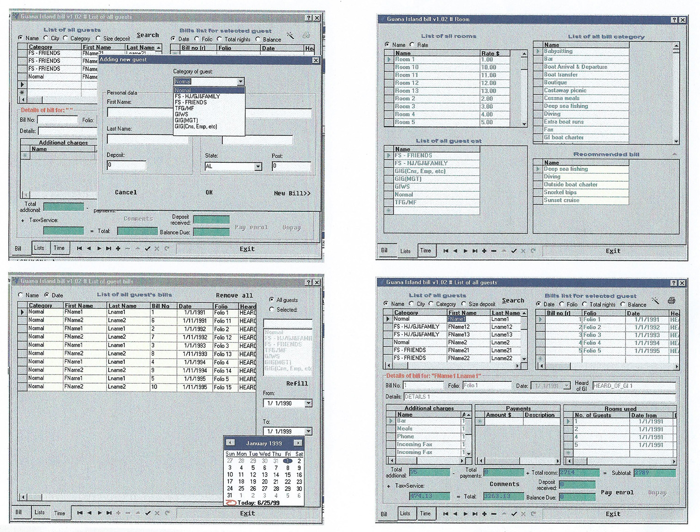
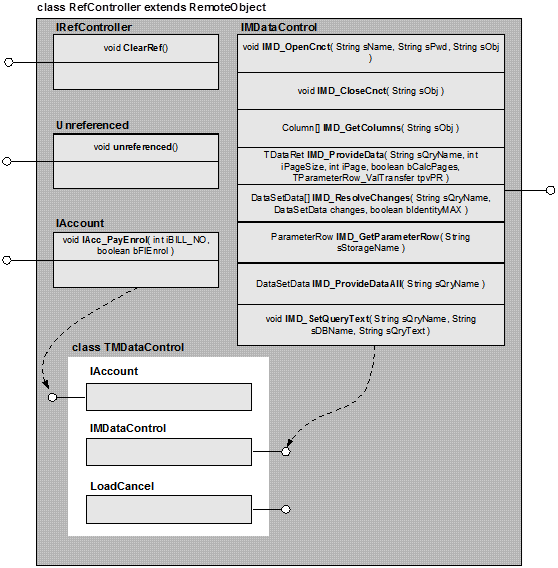

## Guana Island Billing System

A billing system, which implemented in two versions: in MFC against MS SQL and in Borland C++ - Builder against MS Access.

**Remote server architecture** 

>[Full doc](./g_mfc/DOC/plan.doc)

## Автоматизированные функции

Их  можно разделить на две большие группы: ведение счетов гостей, ведение списка служащих с их штатным расписанием и учётом отработанного времени. Группа операций со счетами включает в себя:
* операции с данными о гостях;
* операции со счетами гостей;
* операции с системными списками;
* отчётность.

**Группа операций со служащими и штатным расписанием включает в себя:**
* операции со служащими;
* операции с системными списками;
* операции с расписанием;
* учёт отработанного времени и его оплаты.
 
**Операции с данными о гостях**
* добавление нового гостя;
* поиск гостя;
* удаление гостя;
* снятие/зачисление денег на депозит гостя;
* просмотр отсортированного по различным критериям списка гостей.
 
**Операции со счетами гостей**
* выписывание счёта гостю;
* удаление счёта;
* заполнение счёта;
    * редактирование данных об использованных комнатах;
    * редактирование данных о платежах;
    * редактирование данных о платных услугах;
* выполнение начисления оплаты гостю по счёту;
* возврат денег;
* модификация и повторное начисление счёта;
* просмотр итоговых суммарных показателей по счетам;
* суммарная отчётность за период времени по отдельным категориям гостей;
* выдача итоговой распечатки счёта гостю;
* выдача распечатки бухгалтерской отчётности за период времени по категориям.
 
**Операции с системными списками**
* ведение списка категорий гостей;
* ведение списка комнат;
* ведение списка категорий оплаты;
* ведение списков наиболее вероятных категорий оплаты для каждой категории гостей.
 
**Отчётность**
* счёт для гостя, содержащий полный отчёт об использовании им комнат, платных услуг, выполненных оплатах и расчёт начислений;
* итоговый бухгалтерский отчёт за промежуток времени отдельно для каждой категории гостей.

**Операции со служащими**
* приём нового служащего;
* поиск служащего;
* просмотр отсортированного по различным критериям списка служащих;
* удаление служащего;
* просмотр списка счетов, выписанных служащим за определённый период времени.
 
**Операции со штатным расписанием**
* назначение работы служащему;
* просмотр списка работ, назначенных служащему;
* удаление работы.

**Учёт отработанного времени**
* внесение данных о прибытии служащего на работу;
* внесение данных о завершении работы;
* удаление данных об отработанном времени;
* выдача отчёта об отработанных часах за определённый промежуток времени и расчёт оплаты.

**Ведение системных списков**
* операции со списками языков, отделов, работ, категорий работы, видов времени, и типов занятости служащих.

